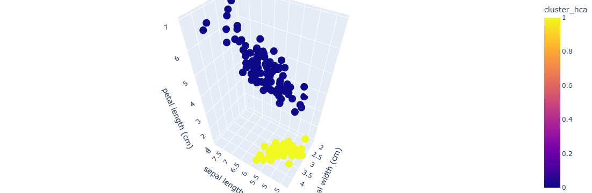

# **Iris Dataset Clustering Analysis**

The objective of this project is to evaluate your understanding and ability to apply clustering techniques to a real-world dataset. This project demonstrates the application of unsupervised machine learning techniques, specifically KMeans and Hierarchical Clustering, on the Iris dataset. The goal is to identify natural groupings of the data and compare them with the actual species labels.

# Methodology

- **1. Data Preprocessing**

- Load the Iris dataset using sklearn.

- Convert species labels to a categorical object for reference.

- Drop the species column for clustering.

- Scale the features.

 **2. KMeans Clustering**

- Description: KMeans partitions the dataset into k clusters by minimizing the distance between points and their cluster centroids.

- Elbow Method: Used to find the optimal number of clusters by plotting the Within-Cluster Sum of Squares (WCSS) against different k values.

- Implementation: Applied KMeans  

- Visualization: 3D scatter plot with clusters and centroids.

**3. Hierarchical Clustering**

- Description: Hierarchical clustering builds a hierarchy of clusters either agglomeratively (bottom-up) or divisively (top-down).

- Dendrogram: Visualized to determine cluster hierarchy and optimal number of clusters.

- Implementation: Applied Agglomerative Clustering with n_clusters=2.

- Visualization: 3D scatter plot and dendrogram for cluster analysis.

# Tools and Libraries Used

- Python 3.x

- Pandas

- NumPy

- Matplotlib

- Seaborn

- Scikit-learn

- Plotly (for interactive 3D visualization)

- SciPy (for hierarchical clustering dendrograms)

.png)

.png)

